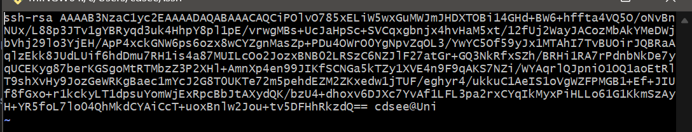

###git配置
>设置用户名和邮箱

安装git后首先要设置用户名称和e-mail地址
```
git config --global user.name " "   ##若名称没有空格，可不打双引号
git config --global user.email ""

参数 
    (默认省略)Local    本地配置 只对本仓库生效
    --global 全局配置 对所有仓库生效
    --system  系统配置  对所有用户生效

```


配置完成后 输入命令`git config --global --list`查看配置


###创建仓库
文件夹==仓库
创建仓库有两种方式: 
一种是在本地创建仓库       git init
一种是在远程克隆一个仓库   git clone

创建一个文件夹  git init初始化仓库

###工作区域和文件状态
#####本地数据分为三个区
1. 工作区 Working Directory   
2. 暂存区 Staging Area/Index
3. 本地仓库 Local Repository
工作区 --> git add 暂存区 --> git commit 本地仓库
#####
1. 未跟踪 Untrack 新创建但还没被git管理的文件
2. 未修改 Unmodified 被git管理但文件内容还未修改的文件
3. 已修改 Modified 已修改的文件但未放到暂存区 
4. 已暂存 Staged  已经存放到暂存区的文件


####添加和提交文件
```
git init     创建仓库
git status  查看仓库状态
git add     添加到暂存区
git commit  提交到本地仓库 (只会提交暂存区的文件，不会提交工作区的文件)

##git commit 使用时需要 -m补充提交信息 否则会进入交互式界面默认vim编辑
```

####git reset回退版本 
<br>

ssh文件夹位置在/c/Users/用户/.ssh
如果是第一次配置ssh，用户目录下可能没有.ssh
打开git bash  输入命令
####SSH配置和克隆仓库  

将代码push到远程仓库有两种方法一种是https，一种是SSH

https在push时需要验证用户名和密码
ssh方式不需要验证用户名和密码，但需要在Github上配置ssh公钥
<br>
#####ssh的配置


`ssh-keygen -t rsa -b 4096 ##指定密钥长度为4096`  
创建密钥
密钥名称   第一次直接回车 默认id-rsa
密钥密码   直接回车就是空密码

进入.ssh文件夹下可以看到两个密钥

如图 其中没有后缀的是私钥文件  后缀为.pub的是公钥文件
输入命令`vim id-rsa.pub`进入vim编辑器中 复制公钥

GitHub --> 头像 setting --> SSH and GPG keys

粘贴到如下位置，并给公钥取名完成配置。
***


<br>

###关联本地仓库和远程仓库
github中新建仓库

```
git remote add <shortname> <url>
git remote add origin git@github.com:cdsee045/Notes.git  
                                  ##添加一个名为origin的远程仓库
git branch -M main                ##指定分支的名字为main
git push -u origin main ：main     ##把本地和远程的main分支关联起来
如果两个分支名称相同则可以简写为  git push -u origin main
```


conclusion
```
添加远程仓库  
1. git remote add<远程仓库名><远程仓库地址>
2. git push -u<远程仓库名><分支名>

查看远程仓库 git remote -v

拉取远程仓库  git pull <远程仓库名><远程分支名>:<本地分支名>  ##相同则可以省略冒号后的部分
```


***

###vscode中git的使用

快捷键
ctrl shift p 打开命令面板
ctrl shift ~ 新建终端

打开资源管理器 修改文件后可以看到源码管理器多了角标


选中项目后可以看到四个选项


第一个选项是打开文件
第二个选项是撤销修改
第三个选项是暂存修改  相当于git add操作，保存到stage区
第四个选项表明文件状态  是已修改状态
进行暂存修改后会将文件转到stage区


上方的提交即 git commit 操作 消息框中的信息即 git commit -m后的内容


点击提交后会转到本地仓库


此时弹出的同步修改即将内容同步到远程仓库
<br>
<br>
***
###分支