###python安装
window版本下可以用scoop通过命令scoop install python直接下载
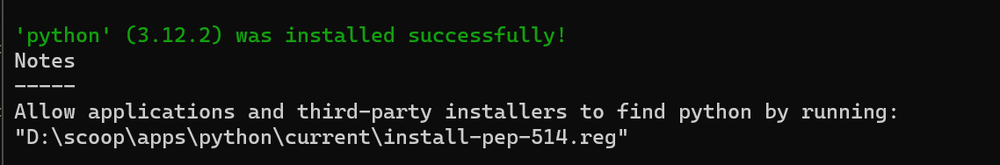
下载终端输入python出现
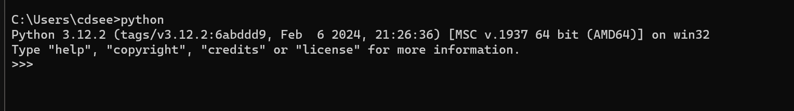
出现如下命令则表示安装完成

###第二章
####注释
单行注释 #定义
多行注释 三个引号定义
#####print函数
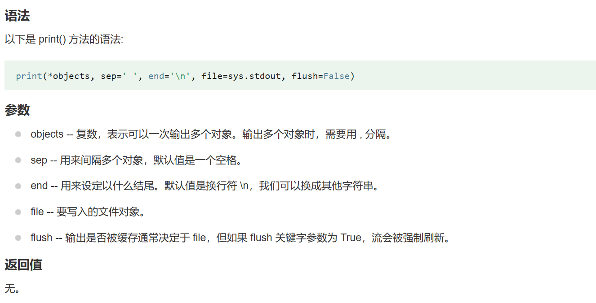
print("hello",end='')  ##不换行

```
print("Hello world")
print("Hello\tworld")  #\t 默认缩进4个空格 
print("iTHE\tBEST")    #单词对齐
```
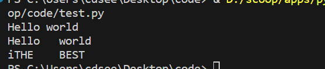
```
print(1)  
1  
print("Hello World")  
Hello World  
 
a = 1，b = 'runoob'
print(a,b)
1 runoob
 
print("aaa""bbb")
aaabbb
print("aaa","bbb")
aaa bbb
 
print("www","runoob","com",sep=".")  # 设置间隔符
www.runoob.com
```

####变量
在 Python 中，每个变量在使用前都必须赋值，变量赋值以后该变量 才会被创建。
在Python中变量是**没有类型**的，我们所说的字符串变量是指该变量存储了一个字符串类型的数据。
<br>
####数据类型
#####type()语句
查看数据类型 type既可以直接查看字面量的数据类型，也可以查看到变量所存储的变量类型。
```
print(type(123))      
print(type(1.23))
print(type("你好"))
```
#####类型转换
数据类型转换可以分为两种：隐式类型转换 - 自动完成  和 显式类型转换 - 需要使用类型函数来转换
隐式转换
对两种不同类型的数据进行运算，较低数据类型（整数）就会转换为较高数据类型（浮点数）以避免数据丢失。
显式转换
在显式类型转换中，用户将对象的数据类型转换为所需的数据类型。 我们使用 int()、float()、str() 等预定义函数来执行显式类型转换。
注 任何类型都可以转换成字符串类型，只含有数字字符串才能转换成数字
<br>
####标识符
变量，方法，类的名字等，自定义的名字称为标识符
命名规则，不可以数字开头，大小写敏感，不可使用标识符
只允许出现英文中文数字下划线四类元素
命名规则
见名知意  和内容的意思一样
下划线命名  多个单词组合用下划线分隔
英文字母全小写
<br>
####运算符
^ 按位异或运算符 当两对应的二进位相异时结果为1
** 乘方运算符

####字符串
定义方式 单引号 双引号 三引号
引号的嵌套 双引号嵌套单引号 单引号嵌套双引号   \进行转义
#####字符串拼接
用+号连接两个字符串，例如
`
print("hello"+"world")  输出为helloworld
`
也可以拼接两个字符串字面量
`
name="小李"  address="山西省平遥县"
print("name"+"address")
`
注 只适用于字符串类型的拼接，无法和非字符串进行拼接
<br>
####字符串格式化
因为字符串无法和其他类型完成拼接，此时需要字符串格式化
```
name="黑马程序员"  message="学IT就来 %s" % name
## % 表示占位 s表示将变量变成字符串并放入占位的地方

对于多个变量占位，需要用括号括起来
age=20  num=30232
message="性别男，年龄%d,学号%d" %(age,num) 
```

精度控制
用m.n控制数据的宽度和精度
m 控制宽度，要求是数字 
.n控制小数点精度，要求是数字，对小数进行四舍五入
%5.2f表示将宽度控制为5，将小数点精度设置为2

快色格式化 f 内容{变量}
`
name="小李"; age=20
print(f"我是{name},年龄{age}")
`
####数据输入 input语句
input(提示内容)  从键盘获取输入
获取的数据是**字符串**类型  
`
name=input("你的名字");  提示内容输出后会从键盘读取输入
`
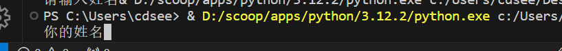
<br>
***


###第三章
####if语句
语法格式
`
if 条件:
    条件成立要做的事
`
注 1. 判断条件的结果是bool类型  
   1. 判断条件还有一个冒号  
   2. 通过四个空格缩进来确定属于if的代码块
<br>
#####if else语句
语法格式
`
if 条件:
    条件成立的代码
else:   
    条件不成立的代码
`
#####if elif
if 条件1:
    内容1
elif 条件2:
    内容2
...
else:
    内容3

####for循环
逐个循环
for 临时变量 in 待处理数据集:
    条件满足是执行的代码
```
name="Liweijian"
for x in name:  ##把name逐个取出 一一打印
    print(x)
```
例题
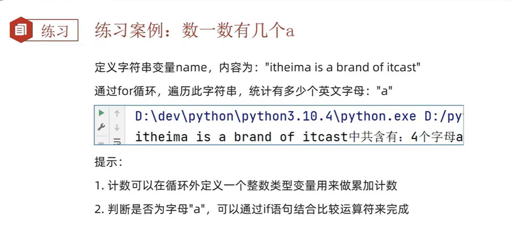

```
sum=0
mess="itheima is a brand of itcast"
for x in mess:
    if x == "a":
        sum+=1
print(f"被统计的字符串中有{sum}个a")
```

#####range语句
for循环中的待处理数据集 称之为 序列类型
序列类型指 其内容可以**一个个依次取出的类型** 包括 字符串 列表 元组 
range(num)
语法1
获取一个从0开始 到num结束的数字序列(不含num本身)
如range(5)取得的数据是：[0,1,2,3,4]
语法2
range(num1,num2)
获得一个从num1开始 到num2结束的数字序列(不含num2)
range(5,10)取得的数据是[5.6.7.8.9]
语法3
range(num1,num2,step)
步长为step
range(5,10,2) [5,7,9]

####continue和break关键字
continue 中断本次循环 直接进入下一次循环
```
for i in range(1,100):
    语句1 
    continue          #语句2不会执行 
    语句2  

```
break 结束所在的循环
```
for i in range(1,100):
    语句1
    for j in range(1,100):
        语句2
        break                #输出语句1 2 4 1 2 4
        语句3
    语句4
```
<br>

###第五章函数
函数的定义:
def 函数名(传入参数):
    函数体
    return 返回值

函数的调用 
函数名(参数)

注 函数必须先定义后使用 参数 返回值不需要可以省略
函数返回值
无返回值的函数，实际上返回了None这个字面量
None用于if判断,相当于False
None用于无内容变量，定义变量但暂时没有具体值

#####函数的说明文档
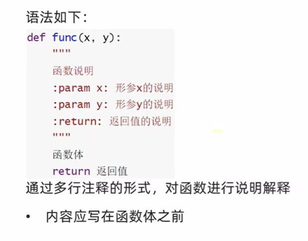
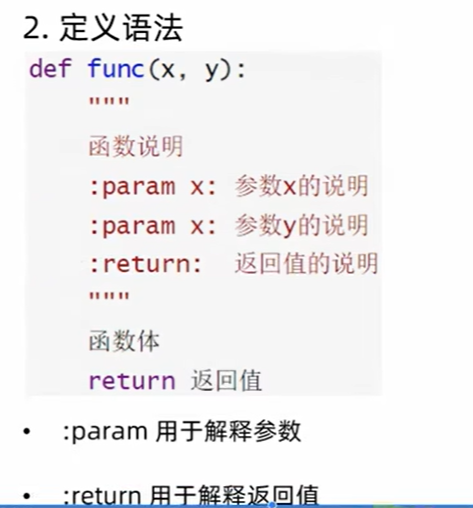

#####函数的嵌套使用
作用域
局部变量 作用在函数内部
全局变量 在函数内部和外部均可使用
global 可以将局部变量变成全局变量
函数内部不能改变在外面定义的变量，想要改变则需要在函数内使用global关键字
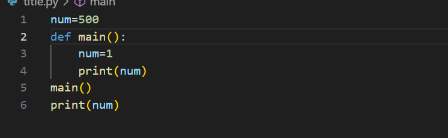
如图，main函数中的num只作用于该函数内部，因此第二个print打印的仍是500

<br>

###第六章 数据容器
一种可以**容纳多份数据**的数据类型，每一份数据称之为1个元素，每个元素可以是任意类型的数据
python中数据容器有list(列表) tuple(元组) str(字符串) set(集合) dict(字典)
####数据容器:列表
#####定义格式
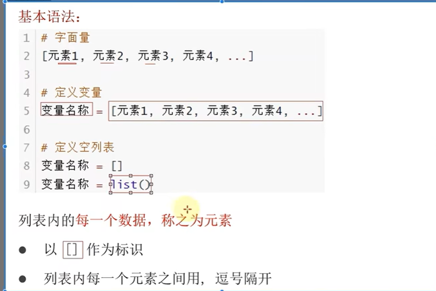
列表中可以为不同的数据类型且支持嵌套
`my_list=['it',666,True]`
#####列表的下表索引
按照下表索引，可取得对应位置的元素
注: 正向从0开始
` my_list[0]  #即取出it`
反向索引 反向从-1开始
`my_list[-3]   #取出it`
#####列表的常用操作方法

1方法的概念
在Python中，如果将函数定义为class的成员，此时函数称为方法
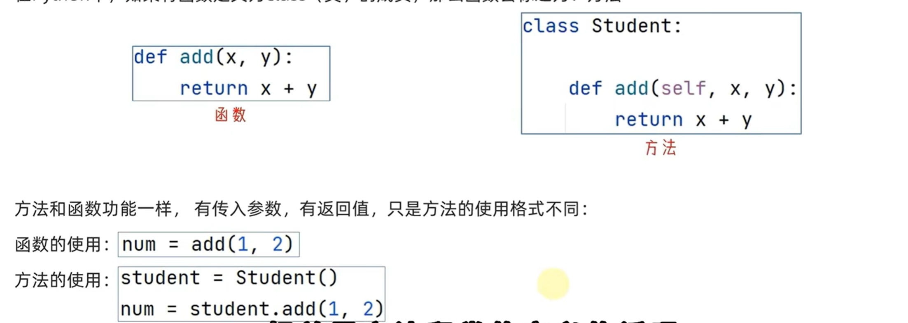

2index方法
查找某元素的下标
语法 列表.index(元素)
```
mylist=['it','hello','Wang']
index=mylist.index("it")
print(index)
第一个下标是0 所以会返回0
```
3修改元素
语法 列表[下标]=值

4插入元素
语法 列表.insert(下标，元素) 在指定下标插入对应元素
```
mylist=['it','hello','Wang']
index=mylist.index("it")
mylist.insert(0,"nihao")
print(mylist)

将nihao插入到第0个元素 
此时输出['nihao', 'it', 'hello', 'Wang']
```
5追加元素
语法 列表.append(元素) 将元素追加到列表的尾部
```
mylist=['it','hello','Wang']
mylist.append("黑马")
print(mylist)
```

列表.extend(其他元素容器) 将其他容器的内容取出，以此添加到列表尾部
```
mylist=['it','hello','Wang']
mylist2=[1,2,3]
mylist.extend(mylist2)
print(mylist)

输出  ['it', 'hello', 'Wang', 1, 2, 3]
```
6元素删除
语法 del  列表[下标]
   或 列表.pop(下标)

7删除某元素在列表中第一个匹配项
列表.remove(元素)
```
mylist=['it','hello','Wang',"hello"]
mylist.remove("hello")
print(mylist)

['it', 'Wang', 'hello'] 可见删除了第一个hello
```
8清空列表
mylist.clear()

9统计列表内某个元素的数量
语法 列表.count(元素)

10统计列表一共有多少元素
语法 len(列表)


总结
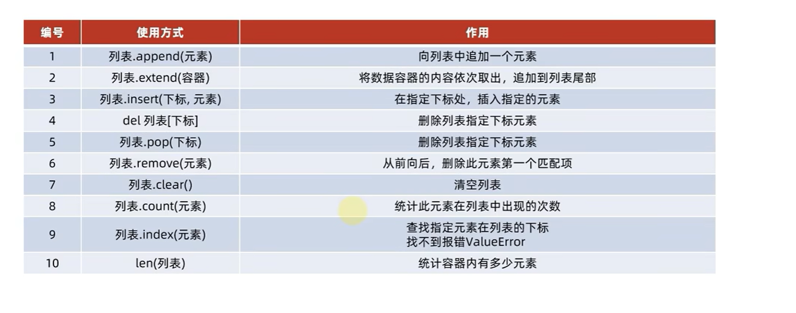

####列表的遍历
把容器内的元素依次取出
#####while循环
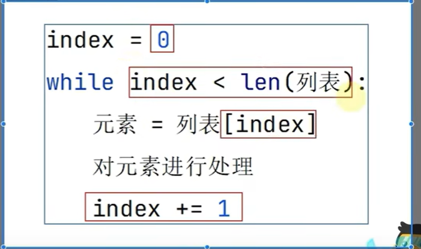

#####for循环
    for 临时变量 in 数据容器:
tips
while 需要自定循环条件  while循环适用于任何循环场景
for循环不需要自定循环条件 适用于数据容器的场景或简单的固定次数的循环场景

####数据容器元组 Tuple

列表是可以被修改的，如果想要内容不被修改，此时就需要元组
即元组定义后就不可更改  元组是不可修改的列表

######元组的定义
定义元组使用**小括号**，用**逗号**隔开隔开数据
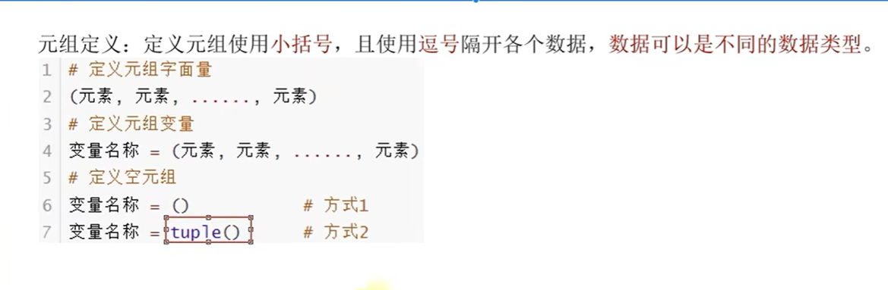

元组是不可修改的列表，操作方法和列表大同小异
元组中的list可以修改

####数据容器 字符串
字符串是字符的容器，一个字符串可以放任意数量的字符。
字符串和其他容器一样，也可以使用下标索引,字符串不可以修改
```
my_str="itheima and itcast"
#index方法  查找位置
value=my_str.index("and")

#replace方法
语法 字符串.replace("字符串1","字符串2")
将字符串1的内容替换为字符串2    ***字符串本身不变 得到一个新字符串
new_str=my_str.replace("it","程序")

输出结果 my_str  itheima and itcast
        new_str  程序heima and 程序cast


#split方法
语法 字符串.split(分隔符字符串)
按照指定的分隔符字符串，将字符串划分为多个字符串，并存入列表对象中，字符串本身不变 得到一个列表对象
my_str="hello heima itcast"
str_list=my_str.split(" ")

得到一个列表 ["hello","heima","itcast"]


#strip方法
语法 字符串.strip()
去除前后空格 
my_str=" itheima and itcast "
my_str.strip()


输出 itheima and itcast


如果传入参数，则删除前后对应的内容
my_str="itheima and itcast"
my_Str.strip("i")

输出 theima and itcast   只会处理前后的数据

#c统计字符串中某字符串出现次数count
my_str.count("it")


#统计字符串的长度 len()
len(my_str)
```

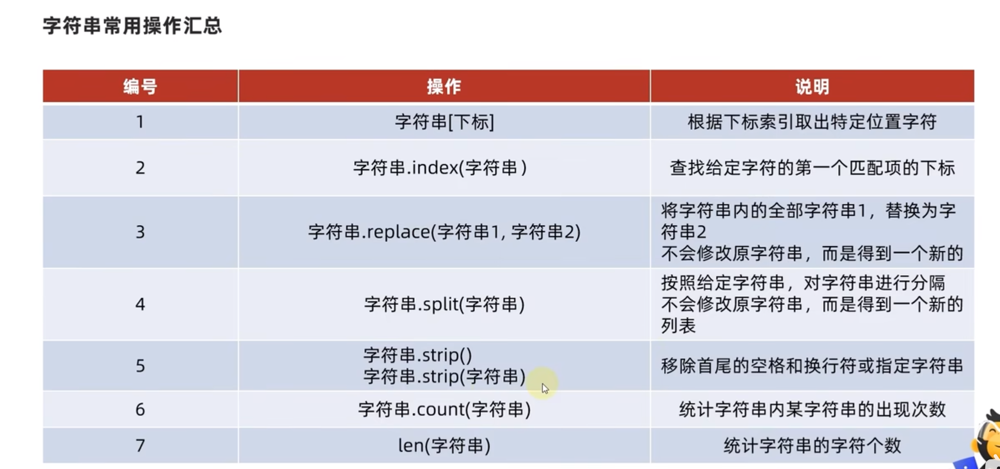

作为数据容器，字符串只可以存储字符，不可以修改 
